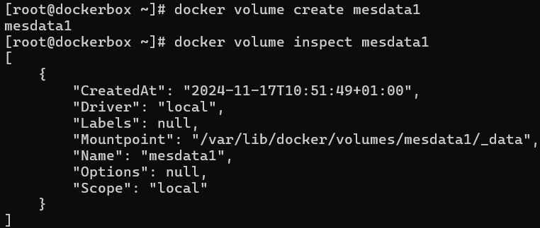
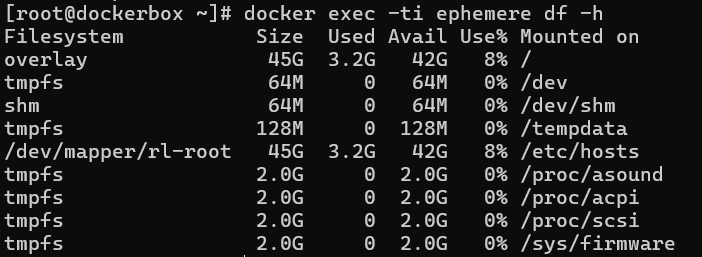

# 10 - Gérer les volumes

> Source : [https://blog.microlinux.fr/formation-docker-10-volumes/](https://blog.microlinux.fr/formation-docker-10-volumes/)

## Commandes : 

**Remarque :**, on monte un dossier dans un volume, jamais un fichier. Si on veut monter un fichier, on fait avec un Dockerfile et un COPY. Sinon, on mets à DOSSIER. Et ne as oublier de mettre `:ro` ou `:z` pour les droits.

```
docker run --name autre_nginx -d -p 8080:80 -v ~/pagesweb:/usr/share/nginx/html:ro nginx
docker volume create testdata
docker volume ls
docker volume rm testdata
docker volume inspect mesdata1 #on voit le dossier de sauvegarde sur l'hôte
```



```
docker run -d --name avecvolume --mount source=mesdata1,destination=/root/volume nginx #met la destination du volume dans /root/volume
```

**Remarques :** 
  - C'est tout à fait possible de mettre un volume mais pour plusieurs conteneurs.
  - Si le volume n’existe pas lors du lancement du conteneur, Docker se charge de le créer automatiquement. (mais du coup c'est en Read Only au lieu de Read Write)

```
docker run -dit --name ephemere --mount type=tmpfs,dst=/root/volume nginx #volume ephémère (type=tmpfs). Sinon, par défaut, le type est volume avec l'option mount. Sinon c'est bind avec -v.
docker run -dit --name ephemere2 --mount type=tmpfs,tmpfs-size=256M,dst=/root/volume nginx #pour avoir une taille définie
```

## Exercice 1 :

```
docker volume create volumelocal
docker volume inspect volumelocal #MountPoint : /var/lib/docker/volumes/volumelocal/_data
echo "Ce fichier existe" | sudo  tee /var/lib/docker/volumes/volumelocal/_data/fichier.txt
docker pull httpd
docker run -dit --name montagevolume --mount source=volumelocal destination=/data httpd:latest
docker exec-ti montagevolume /bin/bash
```


```
echo "Coucou depuis le conteneur" >> /data/conteneur.txt
exit
ls -alh /var/lib/docker/volumes/volumelocal/_data/conteneur.txt
cat /var/lib/docker/volumes/volumelocal/_data/conteneur.txt
```

## Exercice 2 :

```
docker run -dit --name ephemere --mount type=tmpfs,tmpfs-size=128M,destination=/tempdata httpd
docker exec -ti ephemere df -h
```


