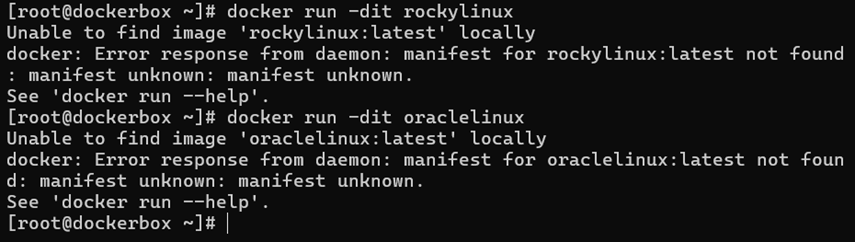
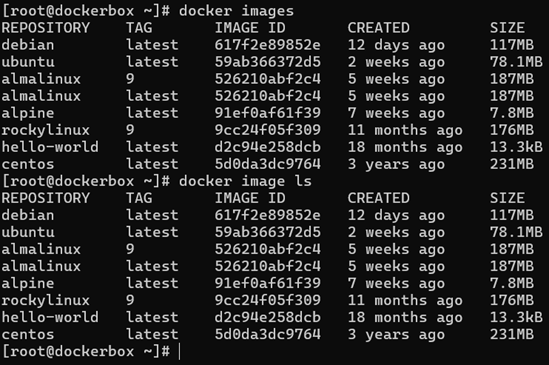

# 2 - Les commandes de base

> Source : [https://blog.microlinux.fr/formation-docker-02-commandes/](https://blog.microlinux.fr/formation-docker-02-commandes/)

## Exercice 1 :

- Image officielle de CentOS : `centos` [https://hub.docker.com/_/centos](https://hub.docker.com/_/centos)
- Image officielle d’Alma Linux : `almalinux` [https://hub.docker.com/_/almalinux](https://hub.docker.com/_/almalinux)

### Lancer un conteneur CentOS

```shell
docker run -dit centos
```

### Lancer un conteneur AlmaLinux

```bash
docker run -dit almalinux
```

### Arrêter un conteneur spécifique par ID, nom ou ID abrégé :

```bash
docker stop [ID] | [NAME] | [SHORT_ID]
```

### Inspecter un conteneur spécifique par ID, nom ou ID abrégé :

```bash
docker inspect [ID] | [NAME] | [SHORT_ID]
```

### Arrêter tous les conteneurs en cours d'exécution :

```bash
docker stop $(docker ps -aq)
```

## Exercice 2 :



Le tag/version latest (par défaut) n’existe pas, il faut aller regarder les différents tags proposés dans dockerhub : [https://hub.docker.com/_/rockylinux](https://hub.docker.com/_/rockylinux) et [https://hub.docker.com/_/almalinux](https://hub.docker.com/_/almalinux). Exemple :

   ```bash
   docker run –dit rockylinux:9
   docker run –dit almalinux:9
   ```
  
## Exercice 3 :

La commande ```bash docker run –it alpine``` permet de lancer le conteneur en mode interactif et d’accéder au shell du conteneur. De ce fait, le conteneur se lance mais dès que l’on sort du conteneur avec ```bash exit```, le conteneur s’arrête. Théoriquement, rappelle toi, que c'est différent que ```bash exec -it```. Car : avec run -it, j'ai une session shell interactive et je peux entrer des commandes comme si j'étais 'dans' le conteneur. A l'inverse, si je conteneur tourne en arrière plan, je peux utiliser le ```bash exec -ti``` pour entrer dans le conteneur existant.

**Remarque :** Même si (Il nous l'a pas fait apprendre mais...) j'ai un shell interactif, je ne suis pas 'vraiment' dans le conteneur au sens où il est isolé du système hôte. Le conteneur partage le noyau du système hôte mais il a un espaèce de noms réseau, de processus et de fichiers séparé, ce qui créé (du coup) cette isolation 

## Exercice 4 :

On peut lister toutes les images téléchargées avec deux commandes :

 ```bash
docker images
docker image ls
```

Voici l’output des deux commandes :


