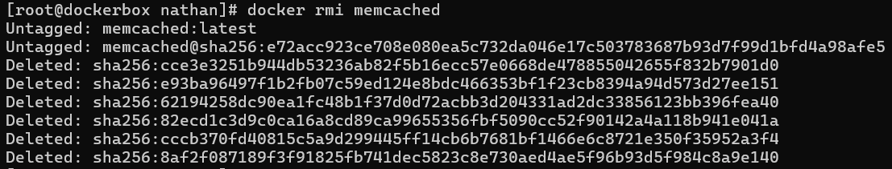
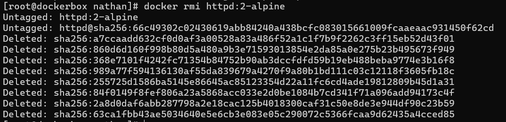

# 3 - Gérer les images des conteneurs

> Source : [https://blog.microlinux.fr/formation-docker-03-images/](https://blog.microlinux.fr/formation-docker-03-images/)

## Commandes :

```bash
docker tag nginx:latest nginx:monblog_prod #duplique mon image nginx et rajoute un tag perso
docker build -t mon_nginx . #construction du conteneur avec le Dockerfile (careful syntax). Mon conteneur s’appellera mon_nginx
docker image prune #supprime les images en suspens
docker system prune -a #supprime les images inutilisées et les images en suspens
docker system df #quantité d’espace disque utilisé par docker

docker pull memcached
docker pull httpd:2-alpine
```
- Espace pris par les deux images : 

  

-	Suppression des deux images :

  ```bash
  docker rmi memchached:latest #(meme pas obligé de mettre le tag car par défaut ça vient pull/remove le latest)
  docker rmi httpd:2-alpine #la obligé
  ```

  
  
