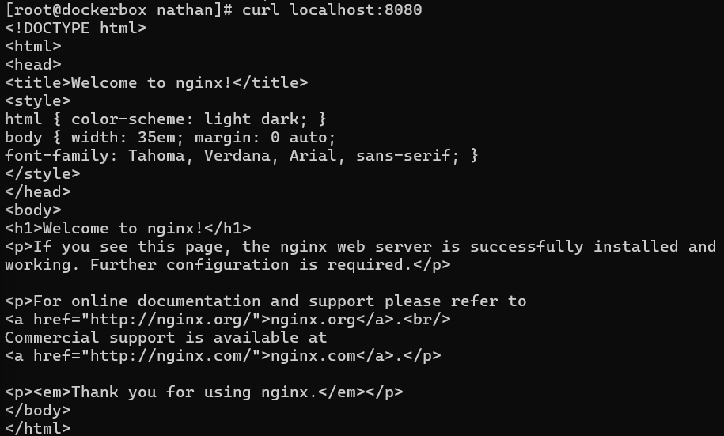
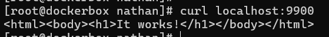
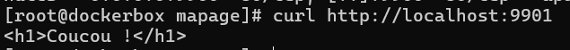
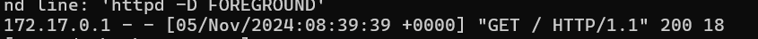

# 5 -Exposer un conteneur

> Source : [https://blog.microlinux.fr/formation-docker-05-exposer/](https://blog.microlinux.fr/formation-docker-05-exposer/)

```bash
docker run --name mon_nginx -d -p 8080:80 nginx #expose le port 8080 sur le pc hôte et 80 à l’intérieur du conteneur
```



**Redirection de port :** Dans VirtualBox, faire une redirection de port :
  - Rule : AYW !
  - Protocole : TCP
  - IP : 127.0.0.1 or blank
  - Port hôte : 8080
  - IP invité : @IP machine hôte
  - Port invité : 80

```bash
docker run --name autre_nginx -d -p 8080:80 -v ${PWD}/pagesweb:/usr/share/nginx/html:ro nginx #volume pour remplacer la page par défaut
```

**Remarque :** 
- Droit à donner pour être sur ':z' et pas 'ro'.
- Attention a donner le répertoire dans lequel se trouve le fichier et pas le fichier lui même (sinon c'est dans un dockerfile avec un COPY)

```bash
docker pull httpd:latest
docker run –name apache -d -p 9900:80 httpd:latest
```
   


```bash
docker run --name apache_coucou -d -p 9901:80 -v ~/mapage/:/usr/local/apache2/htdocs:ro httpd:latest #ne pas mettre le fichier mais le répertoire pour les volumes
```




On voit l'@IP qui a requêtée le conteneur. Dans l'exemple c'est 172.17.0.1 soit la gateway pour tous les conteneurs (car fait avec le curl sur machine hôte)


