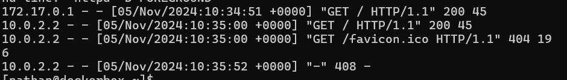
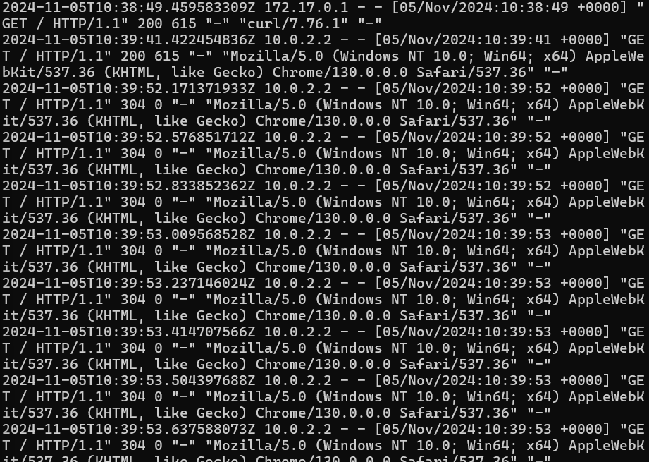
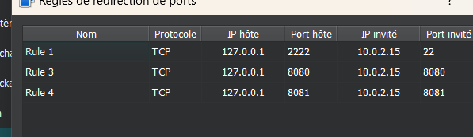

#7 - Gérer les logs de Docker

> Source : [https://blog.microlinux.fr/formation-docker-07-logs/](https://blog.microlinux.fr/formation-docker-07-logs/)

```bash
docker run -dit --name pleindelogs -p 8080:8080 -p 50000:50000 jenkins/jenkins:lts
docker exec pleindelogs cat /var/jenkins_home/secrets/initialAdminPassword 
```
La commande ci-dessus me donne ceci : `cf89b0a63df647afa950c07f10d903ee`

```bash
docker run -d --name apache_logs -p 8080:80 httpd:latest
```



```bash
docker run -d --name nginx_logs -p 8081:80 nginx:latest
```



Redirection sur VirtualBox : 


