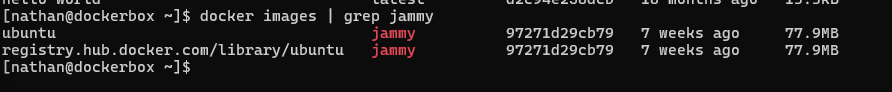

# 8 - Utiliser les registres

> Source : [https://blog.microlinux.fr/formation-docker-08-registres/](https://blog.microlinux.fr/formation-docker-08-registres/)

## Commandes :

```bash
docker pull docker.io/ubuntu:jammy
docker pull ubuntu:jammy #prend le registre par défaut qui est docker.io
docker pull registry.hub.docker.com/library/ubuntu:jammy #autre registre
```



On remarque qu'ils ont le même ID (même empreinte). C'est la même image.
Pour lancer un conteneur (et pas l'autre), il faut alors spécifier le registre dans la commande : 

```bash
docker run -dit registry.hub.docker.com/library/ubuntu:jammy
```

```bash
docker pull mysql/mysql-server #image pas officielle. Espace de nommage : mysql
docker pull bitnami/wordpress-nginx:6.2.2 #espace de nommage : bitnami. Dépot : wordpress-nginx et tag : 6.2.2
```

**Autres registres de conteneurs :**
- [https://aws.amazon.com/fr/ecr/](https://aws.amazon.com/fr/ecr/)
- [https://quay.io/](https://quay.io/)
- [https://cloud.google.com/artifact-registry/docs?hl=fr](https://cloud.google.com/artifact-registry/docs?hl=fr)

```bash
docker login #pour s'authent
```

## Exercice :

```bash
docker rmi -f $(docker images -aq)
docker pull postgres #latest
docker pull postgres:13.11
docker images #ID différent car pas le même tag
docker pull diouxx/glpi:latest
docker pull diouxx/glpi:9.1.4
docker images
docker login -u nathanmartel21 #ou docker login avec un navigateur
docker rmi -f $(docker images -aq)
```
