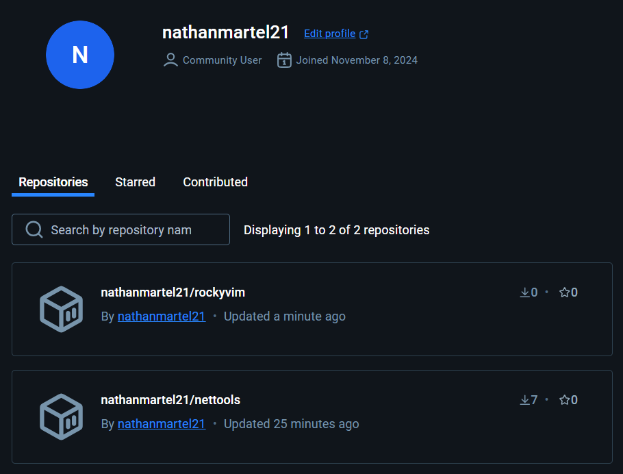

# 9 - Construire une image

> Source : [https://blog.microlinux.fr/formation-docker-09-construire/](https://blog.microlinux.fr/formation-docker-09-construire/)

## Commandes :

```bash
docker build -t kikinovak/dockerping:latest . #. pour le répertoire courant. Careful syntax of Dockerfile !
docker run [image:tag] google.fr #remplacement de l'instruction CMD par google.fr
```
Toujours imbriquer les commandes `RUN` dans un Dockerfile avec des `&&` pour eviter les problèmes de couches.
## Exercice 1 : 

- Contenu du Dockerfile :

```
FROM debian:latest
LABEL maintainer="Nathan Martel <github.com/nathanmartel21>"
RUN apt-get update && apt-get install -y iputils-ping traceroute curl && apt-get clean

#Pas obligatoire :
CMD ["/bin/bash"]
```

- Commandes :

```bash
docker build -t nathanmartel21/nettools:latest .
docker run -dit --name nettools nathanmartel21/nettools
docker exec -ti nettools /bin/bash
ping -c 3 google.fr
curl google.fr
traceroute google.fr
```

**Remarque :** Faire gaffe au problème lié à l'horodatage de la VM et les commandes RUN dans un conteneur. Si le localtime est différent sur la VM (e.g. VM mis en état sauvegardée et pas éteinte) et qu'on update les paquets d'un nouveau conteneur, ça ne fonctionne pas. Bien faire attention a reboot la VM.

## Exercice 2 : 

```bash
docker run -dit --name rockyvim rockylinux:8
docker exec -it rockyvim /bin/bash
yum install -y vim
which vim #--> /usr/bin/vim
```

- Contenu du Dockerfile :

```
FROM rockylinux:8
LABEL maintainer="Nathan Martel <github.com/nathanmartel21>"
RUN yum install -y vim
```

- Commandes :

```bash
docker build -t nathanmartel21/rockyvim -f Dockerfile2 . #car syntax unexpected
docker run -dit --name rockyvim nathanmartel21/rockyvim
docker exec -ti rockyvim /bin/bash
which vim
```
  
**Remarque :** La commande install de vim n'est pas visible dans l'historique du conteneur.

## Exercice 3 :

```bash
docker push nathanmartel21/nettools
docker push nathanmartel21/rockyvim
```


